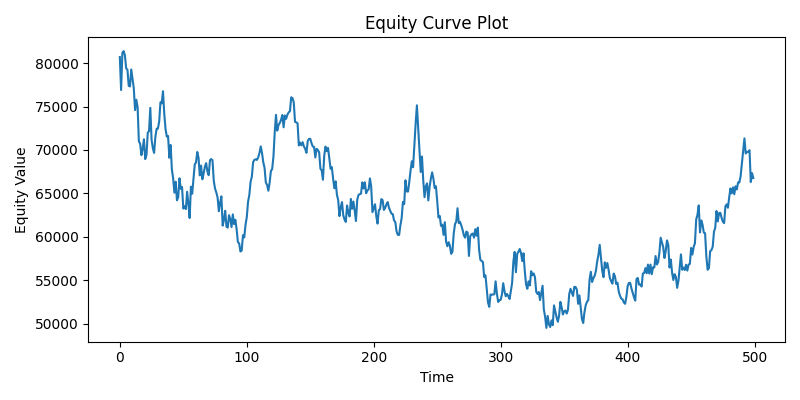

# Backtest Performance Report

## Key Metrics

| Metric | Value |
|--------|-------:|
| Total Return | 66.77% |
| Sharpe Ratio | -0.00 |
| Max Drawdown | -86.46% |

## Equity Curve

## Periodic Returns (summary)

|       |              0 |
|:------|---------------:|
| count | 1832           |
| mean  |   -0.000533654 |
| std   |    0.0154091   |
| min   |   -0.0646231   |
| 25%   |   -0.0107347   |
| 50%   |   -0.00673281  |
| 75%   |    0.0102399   |
| max   |    0.0690878   |

## Interpretation of Results 

The equity curve shows how portfolio value evolved over time.For every iteration of the program, our data changes slightly, and the curve is different each time. There are rises and falls throughout the curve, but an overall decline in equity value.Positive total return and a higher Sharpe ratio indicate favorable risk-adjusted performance. Maximum drawdown highlights worst-case peak-to-trough losses.
Given that market data generation is random, it is hard to assess the effectiveness of our strategies.